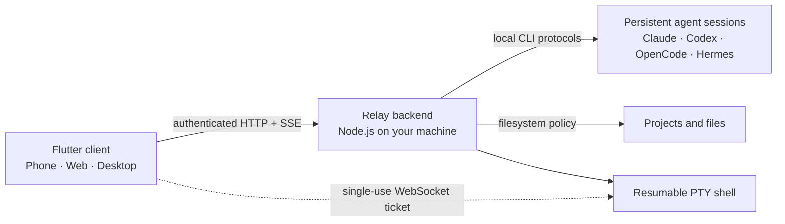

<div align="center">

# Relay

**Run AI coding agents on your machine. Control them from any screen.**

A private, self-hosted remote cockpit for Claude Code, Codex, OpenCode, and Hermes.


[中文](README.zh-CN.md) · [Install a backend](backends/README.md) ·
[Security](SECURITY.md) · [Handbook](docs/handbook.md)

</div>

<a href="assets/screenshots/relay-overview-web.png">
  
</a>

Relay leaves your source code, shell access, and CLI credentials on the computer
you control. Its Flutter client connects from phone, Web, or desktop to a small
Node.js backend running beside your projects—there is no Relay cloud account and
no hosted middleman.

<table>
  <tr>
    <td width="33%" align="center">🖥️<br><strong>Runs where your code lives</strong><br>Your agents and projects stay on your backend machine.</td>
    <td width="33%" align="center">📱<br><strong>One client, every screen</strong><br>Use the same interface on mobile, Web, and desktop.</td>
    <td width="33%" align="center">🔐<br><strong>Private by design</strong><br>Import an encrypted, revocable credential for each device.</td>
  </tr>
</table>

## See Relay in 60 seconds

### Keep real coding sessions within reach

Stream replies, cancel a turn, search history, export Markdown, and switch away
while work continues. Each `workdir + agent` context supports up to eight named,
resumable conversations.

<a href="assets/screenshots/relay-chat-web.png">
  
</a>

### Chat, coordinate, and manage files from mobile

<table>
  <tr>
    <td width="33%" align="center"><a href="assets/screenshots/relay-chat-mobile.png"></a></td>
    <td width="33%" align="center"><a href="assets/screenshots/relay-swarm-mobile.png"></a></td>
    <td width="33%" align="center"><a href="assets/screenshots/relay-files-mobile.png"></a></td>
  </tr>
  <tr>
    <td align="center"><strong>Persistent chat</strong><br>Follow a long-running agent session from anywhere.</td>
    <td align="center"><strong>Swarms</strong><br>Let specialized agents work in one shared transcript.</td>
    <td align="center"><strong>Remote files</strong><br>Browse, upload, download, and change the active work tree.</td>
  </tr>
</table>

<sub>These screenshots were captured in Chromium against an isolated demo backend; they contain no production credentials or project data.</sub>

## How it fits together



The active workdir belongs to each client and is sent on every request. A
conversation is scoped by `workdir + agent + session`, so unrelated sessions
can run concurrently without sharing a global backend directory.

## What you can do

| | Capability | What it gives you |
|---|---|---|
| 💬 | **Live, persistent chat** | Streaming replies, cancellation, named sessions, cross-device history, search, and Markdown export. |
| 🐝 | **Multi-agent Swarms** | Shared transcripts, per-member roles and controls, parallel waves, bounded `@mention` handoffs, and reusable JSON templates. |
| 🎛️ | **Agent controls** | Model, reasoning effort, permission tier, install/auth status, on-demand Codex credential verification, Claude credential expiry, and Fast mode for Claude/Codex. |
| 📁 | **Files and terminal** | Allowed-path browsing, uploads, downloads, zipped folders, workdir switching, and one resumable PTY per device credential. |
| 📊 | **Quota workflows** | Claude/Codex usage views plus one queued prompt for the next detected five-hour reset. |
| 🔔 | **Notifications** | In-app/browser alerts, with optional Web Push and Android FCM for configured deployments. |

Claude Code and Codex are the primary integrations. OpenCode and Hermes are
available as experimental, host-managed integrations. All four keep their
credentials on the backend host; Relay never logs an agent in for you.

## Quick start

### 1. Prepare the backend machine

Install Node.js 18+ and at least one supported CLI on Linux, macOS, or Windows.
Claude and Codex must already be logged in on that host; OpenCode and Hermes use
the provider configuration managed there.

Run the setup command for your backend OS from the repository root:

| Backend OS | Setup command |
|---|---|
| Linux | `./backends/linux/setup.sh` |
| macOS | `./backends/macos/setup.sh` |
| Windows PowerShell | `.\backends\windows\setup.ps1` |

The installer walks through direct access, a named Cloudflare Tunnel, or a
temporary Quick Tunnel. Use HTTPS before exposing a direct deployment publicly.
Linux also needs PM2 and the native tools listed in the
[backend requirements](backends/README.md#requirements); Unix hosts need `zip`
for folder downloads.

### 2. Import an encrypted device credential

Setup prints an encrypted QR code and writes `.relay.png` / `.relay.json` files
under `server/credentials/`. Import one by camera, image/file, or pasted JSON,
then enter its passphrase. Camera scanning is mobile-only; every client supports
file or pasted-JSON import. Generate a separate revocable credential for each
device.

### 3. Pick a project and start working

Choose the backend, set the workdir, and open an agent conversation or Swarm.
Home shows the current machine, current workspace, and up to three recent
workspaces. Tap the machine for CLI status checks, device tokens, and Enter SSH.
Use File system → Set as work path to select the project before sending a task.
Home → Tutorial includes a detailed guide to sessions, controls, Swarms, files,
and the mobile terminal key bar.
For service commands, networking details, and platform notes, continue with the
[backend guide](backends/README.md).

## Security boundary

- Every HTTP API route requires a revocable bearer token; failed attempts are
  rate-limited.
- Credential exports use PBKDF2-HMAC-SHA256 and AES-256-GCM.
- The terminal exchanges that bearer token for a short-lived, single-use
  WebSocket ticket; the long-lived token never appears in the socket URL.
- The file API denies known Relay, SSH, Claude, and Codex secret paths and can
  be restricted further with `RELAY_FS_ROOTS`.
- Quota reporting may read and refresh host OAuth files, but token values never
  reach the Relay API or client.

> [!IMPORTANT]
> Relay is not a sandbox. Agent and terminal processes have the permissions of
> the backend OS user. Run it as a restricted non-root user, terminate TLS for
> public deployments, and read [SECURITY.md](SECURITY.md) plus the
> [production checklist](docs/handbook.md#production-deployment) first.

## Development

```bash
flutter pub get
flutter analyze --no-pub
flutter test --no-pub
npm --prefix server install
npm --prefix server test
```

Run the client with `flutter run`. To serve a self-hosted Web build:

```bash
flutter build web --no-pub --pwa-strategy=none --no-web-resources-cdn
npm --prefix server start
```

The Web flags intentionally disable the service worker and bundle CanvasKit
locally. Windows release builds have been exercised; macOS/Linux desktop
packaging and secure-storage validation are less mature. See the
[development handbook](docs/handbook.md#development-and-builds).

```text
Relay/
├── lib/          shared Flutter client
├── server/       Node.js backend and tests
├── backends/     OS-specific install/service adapters
├── docs/         operations and architecture handbook
├── scripts/      development, deployment, and screenshot helpers
└── test/         Flutter tests
```

Contributors and coding agents should read [AGENTS.md](AGENTS.md). Release
history is in [CHANGELOG.md](CHANGELOG.md), and Relay is released under the
[MIT License](LICENSE).
