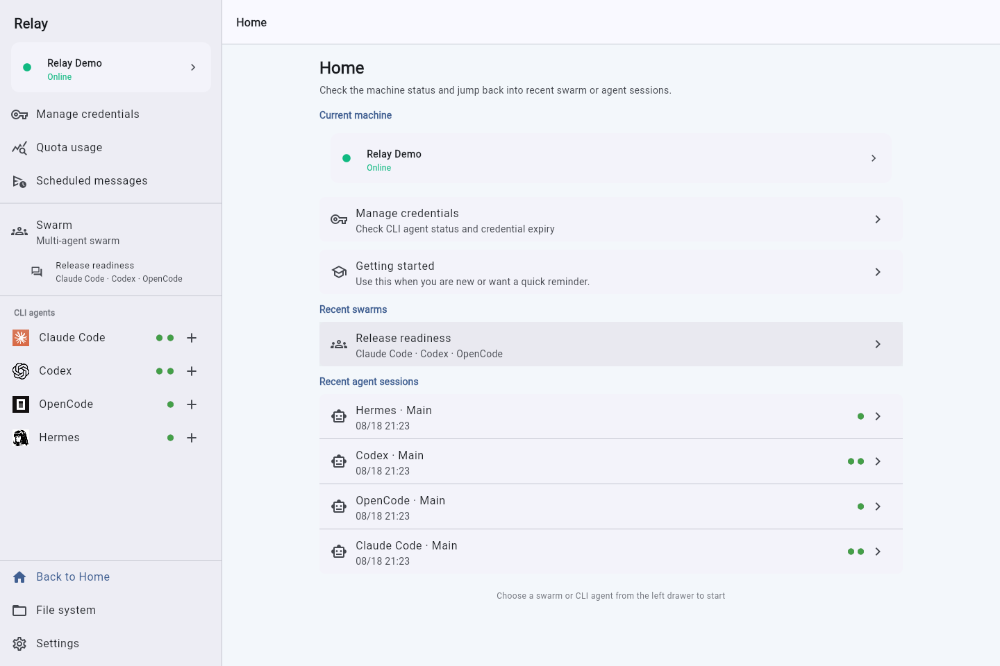
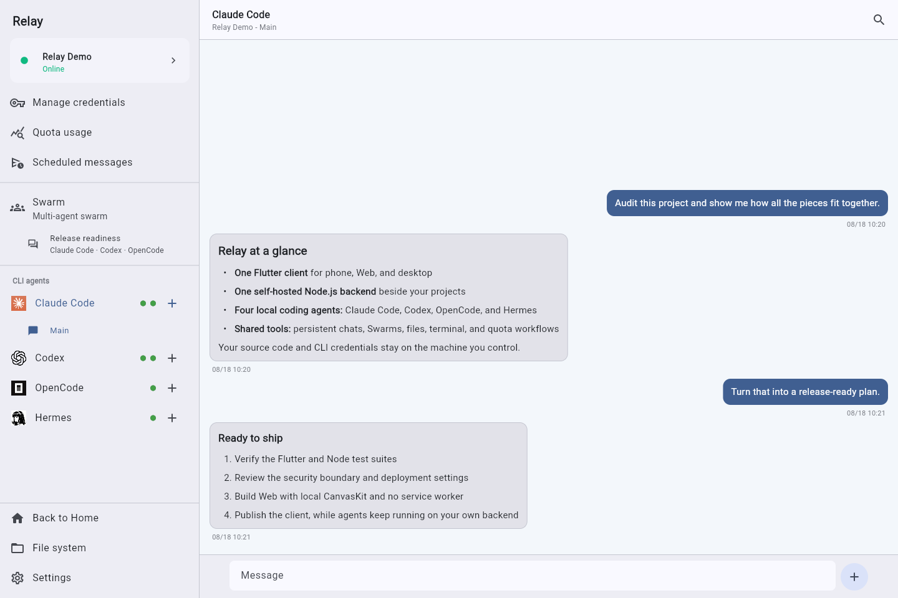
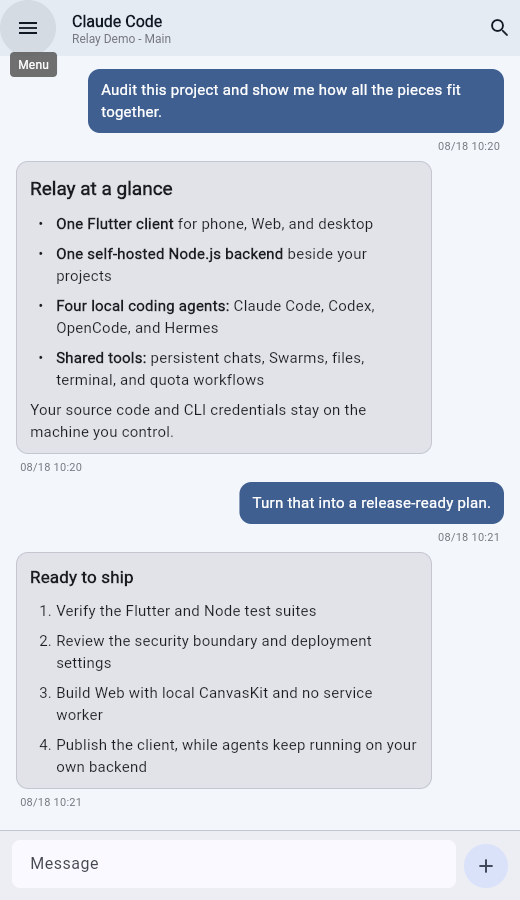
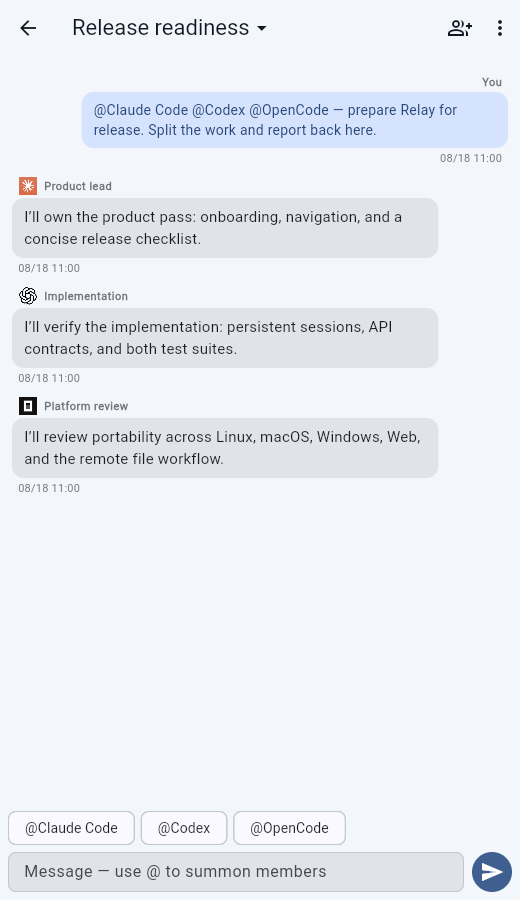
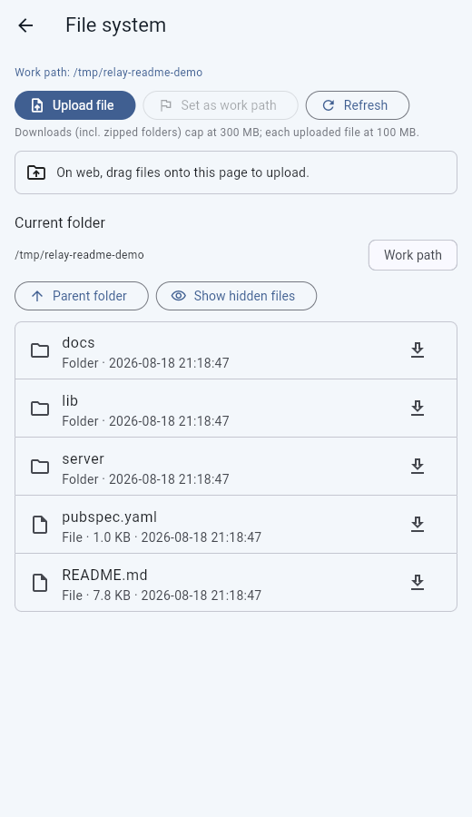
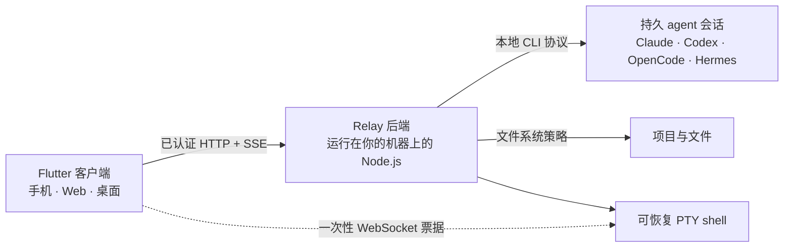

<div align="center">

# Relay

**让 AI 编程智能体留在你的机器上，在任何屏幕上继续控制它们。**

一个连接 Claude Code、Codex、OpenCode 与 Hermes 的私有、自托管远程工作台。


[English](README.md) · [安装后端](backends/README.zh-CN.md) ·
[安全模型](SECURITY.md) · [技术手册](docs/handbook.md)

</div>

<a href="assets/screenshots/relay-overview-web.png">
  
</a>

Relay 把源代码、shell 权限和 CLI 登录凭据留在你控制的电脑上。手机、Web 与桌面共用
一个 Flutter 客户端，连接运行在项目旁边的小型 Node.js 后端——没有 Relay 云账号，
也没有托管中间层。

<table>
  <tr>
    <td width="33%" align="center">🖥️<br><strong>代码在哪里，智能体就在哪里</strong><br>项目和智能体始终留在你的后端主机上。</td>
    <td width="33%" align="center">📱<br><strong>一个客户端，覆盖所有屏幕</strong><br>手机、Web 与桌面使用一致的操作界面。</td>
    <td width="33%" align="center">🔐<br><strong>从设计上保持私有</strong><br>每台设备导入独立、加密且可撤销的凭证。</td>
  </tr>
</table>

## 60 秒看懂 Relay

### 随时接回真实的编程会话

流式查看回复、取消当前回合、搜索历史、导出 Markdown；切换页面后，任务仍可继续。
每个 `工作目录 + agent` 最多支持 8 个可恢复的命名会话。

<a href="assets/screenshots/relay-chat-web.png">
  
</a>

### 在手机上聊天、协作和管理文件

<table>
  <tr>
    <td width="33%" align="center"><a href="assets/screenshots/relay-chat-mobile.png"></a></td>
    <td width="33%" align="center"><a href="assets/screenshots/relay-swarm-mobile.png"></a></td>
    <td width="33%" align="center"><a href="assets/screenshots/relay-files-mobile.png"></a></td>
  </tr>
  <tr>
    <td align="center"><strong>持久会话</strong><br>从任意地点继续长时间运行的 agent 任务。</td>
    <td align="center"><strong>多智能体蜂群</strong><br>让不同职责的 agent 在同一份记录中协作。</td>
    <td align="center"><strong>远程文件</strong><br>浏览、上传、下载并切换当前工作树。</td>
  </tr>
</table>

<sub>这些图片由 Chromium 连接隔离的演示后端截取，不包含生产凭据或真实项目数据。</sub>

## 它是怎样连接起来的



当前工作目录由每个客户端独立保存，并随每次请求发送。会话按
`工作目录 + agent + session` 隔离，因此互不相关的会话可以并行运行，后端不依赖一个
全局工作目录。

## 你可以做什么

| | 能力 | 带来的体验 |
|---|---|---|
| 💬 | **实时、持久会话** | 流式回复、取消任务、命名会话、跨设备历史、搜索与 Markdown 导出。 |
| 🐝 | **多智能体蜂群** | 共享记录、独立角色和参数、并行波次、有限的 `@mention` 接力与可复用 JSON 模板。 |
| 🎛️ | **Agent 控制** | 模型、思考深度、权限、安装/认证状态、按需验证 Codex 凭据、Claude 凭据到期时间，以及 Claude/Codex 快速模式。 |
| 📁 | **文件与终端** | 受策略约束的浏览、上传、下载、文件夹压缩、工作目录切换，以及每个设备凭证一条可恢复 PTY。 |
| 📊 | **额度工作流** | 查看 Claude/Codex 用量，并预约一条消息在下一个检测到的 5 小时额度重置后发送。 |
| 🔔 | **通知** | App/浏览器提醒；配置后还可使用 Web Push 与 Android FCM。 |

Claude Code 与 Codex 是主要集成；OpenCode 与 Hermes 目前是由主机管理的实验性集成。
四种 agent 的凭据都保留在后端主机上，Relay 不会代替你登录。

## 快速开始

### 1. 准备后端主机

在 Linux、macOS 或 Windows 主机安装 Node.js 18+ 和至少一个支持的 CLI。Claude 与
Codex 需要事先在这台主机登录；OpenCode 与 Hermes 使用主机上管理的 provider 配置。

在仓库根目录执行对应系统的安装命令：

| 后端系统 | 安装命令 |
|---|---|
| Linux | `./backends/linux/setup.sh` |
| macOS | `./backends/macos/setup.sh` |
| Windows PowerShell | `.\backends\windows\setup.ps1` |

安装器会引导你选择直连、正式 Cloudflare Tunnel 或临时 Quick Tunnel。直连服务公开
暴露前必须配置 HTTPS。Linux 还需要 PM2 和
[后端前置要求](backends/README.zh-CN.md#前置要求)列出的本地工具；Unix 主机下载文件夹
时需要 `zip`。

### 2. 导入加密设备凭证

安装程序会打印加密二维码，并在 `server/credentials/` 下写入 `.relay.png` /
`.relay.json`。通过相机、图片/文件或粘贴 JSON 导入，再输入生成时设置的密码。相机
扫描仅移动端支持；所有客户端都可以导入文件或粘贴 JSON。建议为每台设备生成一份可
独立撤销的凭证。

### 3. 选择项目并开始工作

选择后端、设置工作目录，然后打开 agent 会话或蜂群。首页显示当前机器、当前工作区和
最多三个最近工作区；点击机器可检查 CLI 状态、管理设备令牌并进入 SSH。
发送任务前，通过“文件系统 → 设为工作路径”选择项目。首页“教程”提供命名会话、
智能体设置、蜂群、文件操作和手机终端快捷键的详细说明。服务命令、网络配置与各平台说明
见[后端安装指南](backends/README.zh-CN.md)。

## 安全边界

- 所有 HTTP API 都需要可撤销的 bearer token；错误凭证尝试会被限速。
- 凭证导出使用 PBKDF2-HMAC-SHA256 与 AES-256-GCM。
- 终端先用 bearer token 换取短时、一次性的 WebSocket 票据，长期 token 不会进入
  socket 地址。
- 文件 API 会拒绝已知的 Relay、SSH、Claude 与 Codex 敏感路径，还可用
  `RELAY_FS_ROOTS` 进一步收紧。
- 额度查询可能读取并刷新主机 OAuth 文件，但 token 值绝不会进入 Relay API 或客户端。

> [!IMPORTANT]
> Relay 不是沙箱。Agent 和终端进程拥有后端系统用户的权限。请使用受限的非 root 用户
> 运行，公网部署时终止 TLS，并先阅读 [SECURITY.md](SECURITY.md) 和
> [生产部署清单](docs/handbook.md#production-deployment)。

## 开发

```bash
flutter pub get
flutter analyze --no-pub
flutter test --no-pub
npm --prefix server install
npm --prefix server test
```

使用 `flutter run` 启动客户端。自托管 Web 构建：

```bash
flutter build web --no-pub --pwa-strategy=none --no-web-resources-cdn
npm --prefix server start
```

Web 参数会有意禁用 service worker，并在本地打包 CanvasKit。Windows release 已实际
验证；macOS/Linux 桌面打包和安全存储验证成熟度较低。详见
[开发手册](docs/handbook.md#development-and-builds)。

```text
Relay/
├── lib/          共享 Flutter 客户端
├── server/       Node.js 后端与测试
├── backends/     各系统安装和服务管理适配
├── docs/         运维与架构手册
├── scripts/      开发、部署与截图工具
└── test/         Flutter 测试
```

贡献者和编程 agent 请先阅读 [AGENTS.md](AGENTS.md)，版本记录见
[CHANGELOG.md](CHANGELOG.md)。Relay 使用 [MIT License](LICENSE) 发布。
